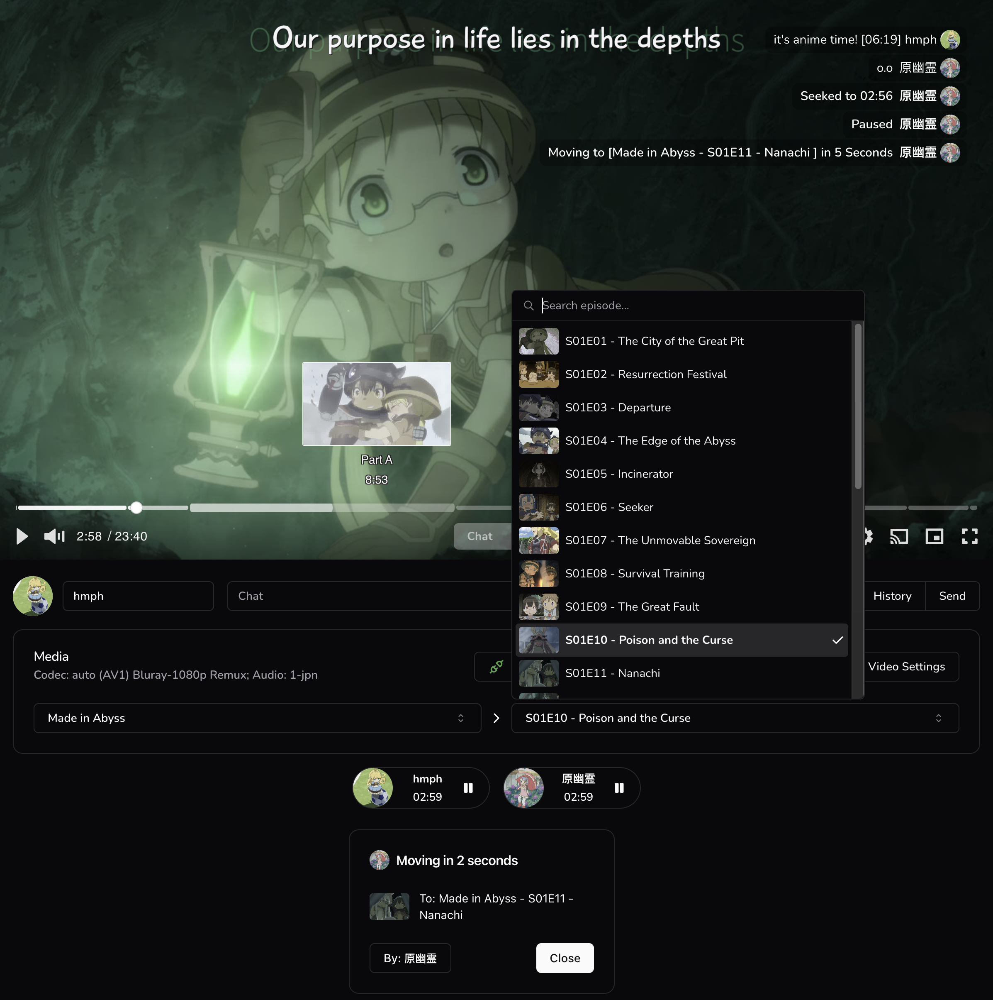
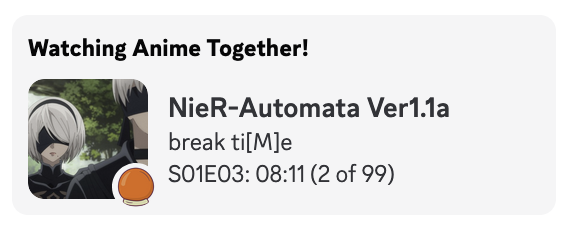
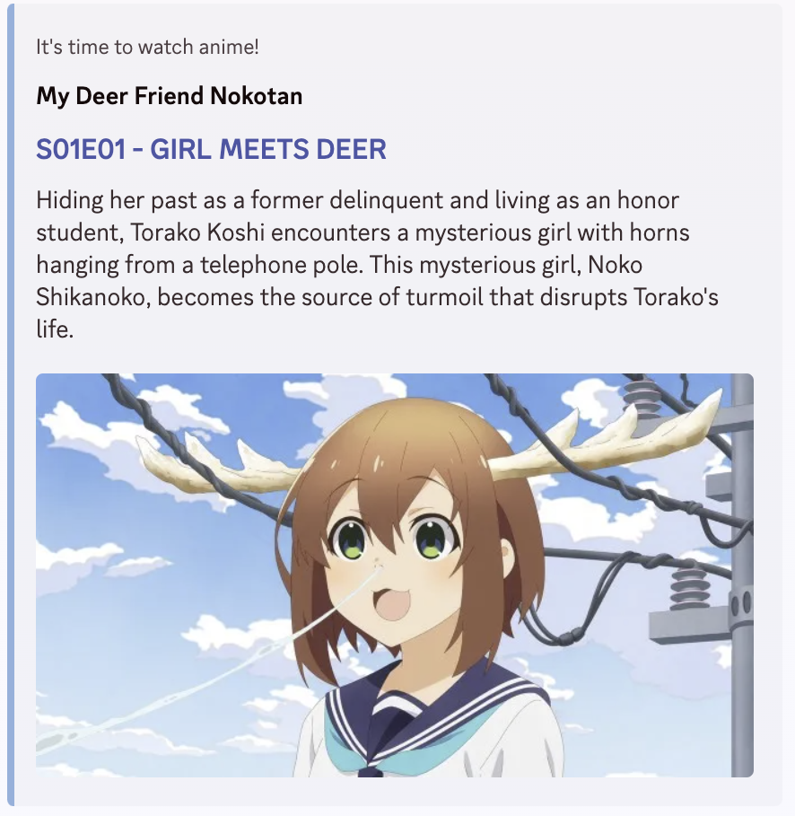

# Discord / Website Watch Party

A fully synced web-based watch party that supports (both on desktop & mobile):

1. `chat`, `profile picture`, `pause/play`, `seek`, `media switch` real-time syncing base on room
2. HDR with `AV1`, `HEVC`, `H.264` codec switching (if browser supports)
3. All main stream subtitles & language selection (note: iOS only supports WebVTT in fullscreen):
    - `SSA/ASS`
    - `WebVTT`
    - `SUP` (the image subtitle format)
    - `SRT`
4. Thumbnail (Video Storyboard/Preview) | Poster (Video Cover)
5. HTML embed headers with dominant color based on show/episode
6. Multiple audio selection
7. Media selection with season and episode support
8. Auto Reconnect
9. In-background (_i.e.,_ tabbed out) notifications
10. Automated video transcoding, stream extraction, and metadata generation in backend



# Discord Activity Support

Discord recently introduced public developer preview activities.
This site can be added into your custom discord activity in developer portal.
Doing so will use discord OAuth2 for username and profile picture syncing.
Channel id will be used as the room id. All functionalities mentioned above are supported in discord activity.


### Discord Status



### Discord Embed



# This repository contains only the frontend & SSR part

The [backend](https://github.com/Prushka/Sparkle-BE) part is still a work-in-progress.

Currently, this project is intended to be used as an extension to
[Sonarr](https://github.com/Sonarr/Sonarr)/[Radarr](https://github.com/Radarr/Radarr) and your local media library.

It needs to be self-hosted like certain media players (_e.g.,_ Plex).

Video files are first processed and transcoded by the backend to:

1. Encode the video files to `AV1`, `HEVC`, `H.264` codecs
2. Generate thumbnails (video storyboards for preview) and posters
3. Extract subtitles and audio tracks
4. Locate and extract nfo files
5. Extract dominant theme color from poster
6. Extract and populate chapter timestamps & titles

# Setup

| Environment Variable           | Description                                                                         |
|--------------------------------|-------------------------------------------------------------------------------------|
| `PUBLIC_STATIC`                | The relative path of all static assets generated by the backend (build time)        |
| `PUBLIC_BE`                    | The relative path of the backend endpoint (build time)                              |
| `SERVER_BE`                    | The full url of the backend endpoint (only visible to Svelte server-side) (runtime) |
| `PUBLIC_DISCORD_CLIENT_ID`     | Your Discord application id / OAuth2 client id (runtime)                            |
| `SERVER_DISCORD_CLIENT_SECRET` | Your Discord application OAuth2 client secret  (runtime)                            |

## Docker Compose

```yaml
services:
  sparkle-fe:
    image: meinya/sparkle-fe:latest
    restart: unless-stopped
    ports:
      - "3000:3000"
    environment:
      - SERVER_BE=http://sparkle:1323
      - PUBLIC_DISCORD_CLIENT_ID=
      - SERVER_DISCORD_CLIENT_SECRET=
```
