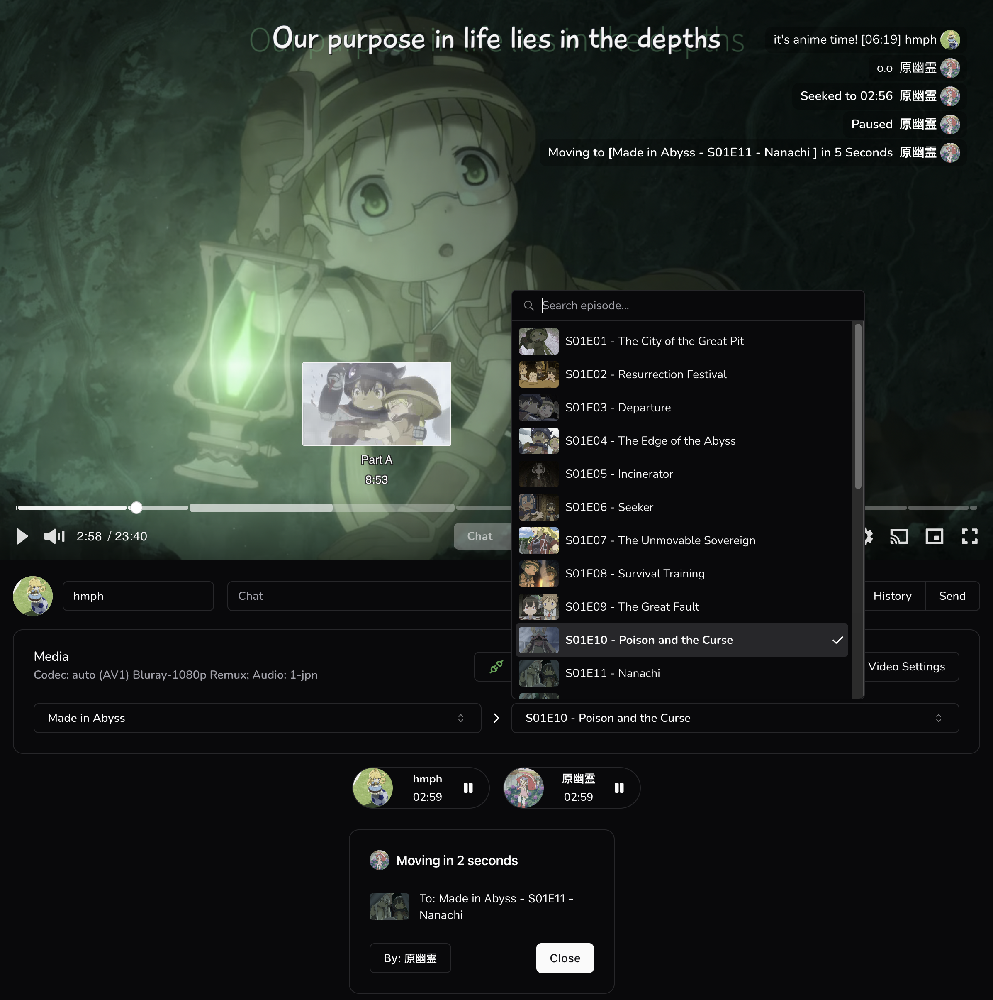
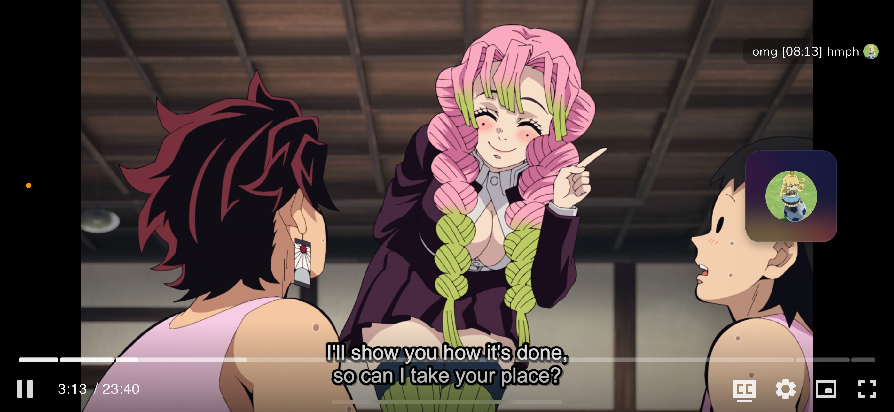
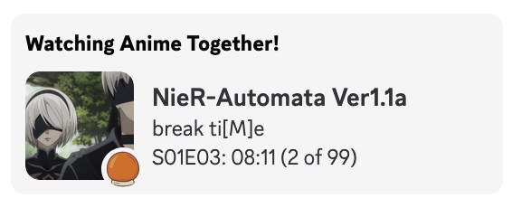
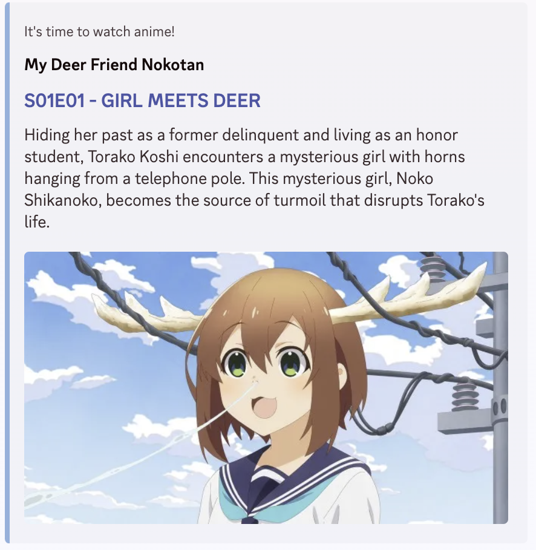

# Discord / Website Watch Party

A fully synced web-based watch party that supports (both on desktop & mobile):

1. `chat`, `profile picture`, `pause/play`, `seek`, `media switch` real-time syncing base on rooms
2. HDR with `AV1`, `HEVC`, `H.264` codec switching (if browser supports)
3. All main stream subtitles & language selection (note: iOS only supports WebVTT in fullscreen):
   - `SSA/ASS`
   - `WebVTT`
   - `SUP` (the image subtitle format)
   - `SRT`
4. Thumbnail (Video Storyboard/Preview) | Poster (Video Cover)
5. HTML embed headers with dominant color based on show/episode
6. Multiple audio selection
7. Media selection with season and episode support
8. Auto Reconnect
9. In-background (_i.e.,_ tabbed out) notifications
10. **Automated video transcoding, stream extraction, and metadata generation** in [backend](backend)



# Discord Activity Support

The same site can serve both Discord and website users. In Discord, the app uses
the Embedded App SDK auth flow, then treats the authenticated Discord user as the
Sparkle user:

- The SDK is initialized only when the app is opened in a Discord Activity frame.
- Users authorize `identify` and `rpc.activities.write`.
- `/api/token` exchanges the authorization code for an access token.
- `authenticate()` returns the Discord user, whose id is used as both
  `profileId` and `playerId`.
- Discord display names and avatars are shown in chat, player lists, and profile
  UI; profile name/avatar editing is disabled for Discord users.
- Rich Presence is updated with `setActivity()` while users watch media.

Discord Activities route browser traffic through the Activity proxy. WebSockets
are supported through the proxy, but WebRTC is not, so Sparkle's browser voice
chat is disabled inside Discord Activities.

### Activity Setup

- Create a new application in [Discord Developer Portal](https://discord.com/developers/applications)
- Add `https://127.0.0.1` as an OAuth2 redirect URI. The Embedded App SDK handles
  returning users to the Activity after `authorize()`.
- Enable Activities.
- Add an Activity URL Mapping for the frontend root, for example `/` to your
  deployed frontend or local tunnel target.
- Add Activity URL Mappings for the backend and static assets. The mapping
  prefixes must match the pathnames configured in `SERVER_BE` and
  `SERVER_STATIC`; for example `/be` and `/static`.
- Add Discord users to Application Testers (they do not need to accept invites)
- Set `PUBLIC_DISCORD_CLIENT_ID` and `SERVER_DISCORD_CLIENT_SECRET` for the
  frontend server.

Example production-style Activity mapping. Discord portal targets omit the
protocol. In Sparkle, `SERVER_BE` and `SERVER_STATIC` may be relative path
prefixes, matching the old Svelte app's public `PUBLIC_BE` and `PUBLIC_STATIC`
values. If either value starts with `http://` or `https://`, Sparkle treats it as
an absolute URL instead.

| Prefix    | Target                       |
| --------- | ---------------------------- |
| `/`       | `sparkle.example.com`        |
| `/be`     | `sparkle.example.com/be`     |
| `/static` | `sparkle.example.com/static` |

With that mapping, configure:

```env
SERVER_BE=https://sparkle.example.com/be
SERVER_STATIC=https://sparkle.example.com/static
PUBLIC_DISCORD_CLIENT_ID=123456789012345678
SERVER_DISCORD_CLIENT_SECRET=...
```

Or, for the relative-path setup used by Discord proxy mappings:

```env
SERVER_BE=/be
SERVER_STATIC=/static
SERVER_INTERNAL_BE=http://sparkle-backend:1323
SERVER_INTERNAL_STATIC=http://sparkle-backend:1323/static
PUBLIC_DISCORD_CLIENT_ID=123456789012345678
SERVER_DISCORD_CLIENT_SECRET=...
```

`SERVER_INTERNAL_BE` and `SERVER_INTERNAL_STATIC` are used by server-rendered
pages and the runtime frontend proxy. Keep them separate so backend API requests
and static asset requests can resolve to different internal routes. The frontend
Docker image reads these values, `SERVER_BE`, `SERVER_STATIC`, and Discord OAuth
settings at container runtime; rebuilding the image is not required for env
changes.

### Desktop Activity


### Mobile Activity



### Discord Status



### Discord Embed



# DEMO

**Demo Website:** [https://sparkle.muddy.ca](https://sparkle.muddy.ca)

The demo website contains only short clips.

# Repository layout

This repository contains the frontend/SSR app and the extracted Go backend under
[`backend`](backend).

Currently, this project is intended to be used as an extension to
[Sonarr](https://github.com/Sonarr/Sonarr)/[Radarr](https://github.com/Radarr/Radarr) and your local media library.

It needs to be self-hosted like certain media players (_e.g.,_ Plex).

Video files are first processed and transcoded by the backend to:

1. Encode the video files to `AV1`, `HEVC`, `H.264` codecs
2. Generate thumbnails (video storyboards for preview) and posters
3. Extract subtitles and audio tracks
4. Locate and extract nfo files
5. Extract dominant theme color from poster
6. Extract and populate chapter timestamps & titles

# Setup

| Environment Variable           | Description                                                                                                                                         |
| ------------------------------ | --------------------------------------------------------------------------------------------------------------------------------------------------- |
| `SERVER_BE`                    | Browser backend base (runtime). Values beginning with `http://` or `https://` stay absolute; other values become relative paths like `/be`          |
| `SERVER_STATIC`                | Browser static asset base (runtime). Values beginning with `http://` or `https://` stay absolute; other values become relative paths like `/static` |
| `SERVER_INTERNAL_BE`           | Private backend base for server-side fetches and the runtime frontend proxy (runtime)                                                               |
| `SERVER_INTERNAL_STATIC`       | Private static asset base for server-side fetches and the runtime frontend proxy (runtime)                                                          |
| `PUBLIC_DISCORD_CLIENT_ID`     | Your Discord application id / OAuth2 client id (runtime)                                                                                            |
| `SERVER_DISCORD_CLIENT_SECRET` | Your Discord application OAuth2 client secret (runtime)                                                                                             |

Built-in chat emotes and room sound effects are bundled in `public/media`, so the
frontend can render and play the curated picker catalog without depending on
third-party media CDNs at runtime.

## Docker Compose

See [`compose.example.yml`](compose.example.yml) for a complete two-service
example using the published frontend and backend images. Build and push both
images with:

```sh
./scripts/docker-build-all.sh
```

```yaml
services:
  sparkle-api:
    image: meinya/sparkle-api:latest
    restart: unless-stopped
    environment:
      - ADDR=:1323
      - OUTPUT=/data/output
    volumes:
      - ./output:/data/output

  sparkle-next:
    image: meinya/sparkle-next:latest
    restart: unless-stopped
    depends_on:
      - sparkle-api
    ports:
      - '3000:3000'
    environment:
      - SERVER_BE=/be
      - SERVER_STATIC=/static
      - SERVER_INTERNAL_BE=http://sparkle-api:1323
      - SERVER_INTERNAL_STATIC=http://sparkle-api:1323/static
      - PUBLIC_DISCORD_CLIENT_ID=
      - SERVER_DISCORD_CLIENT_SECRET=
```
