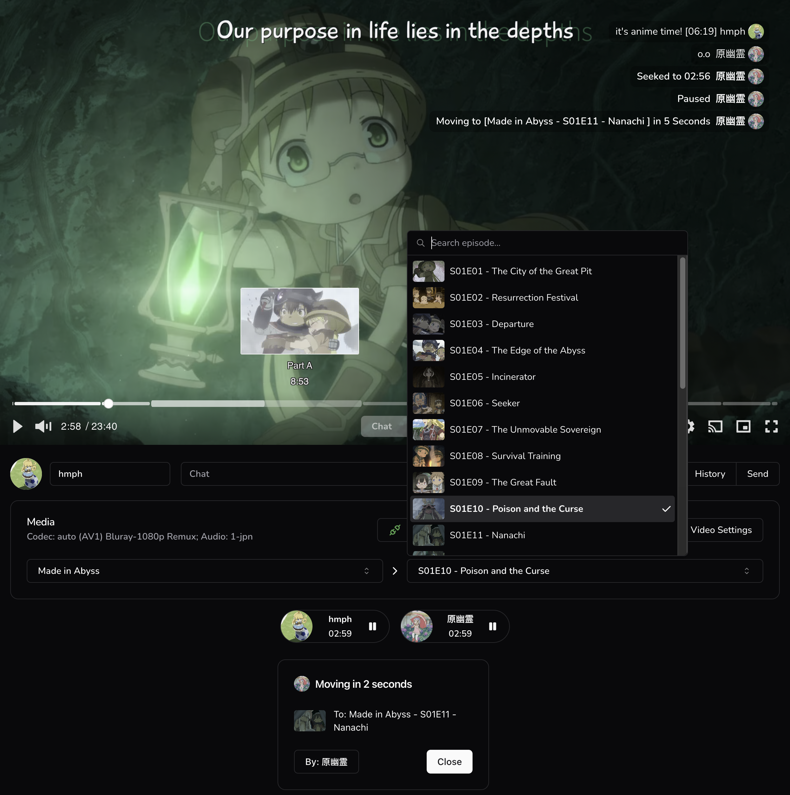
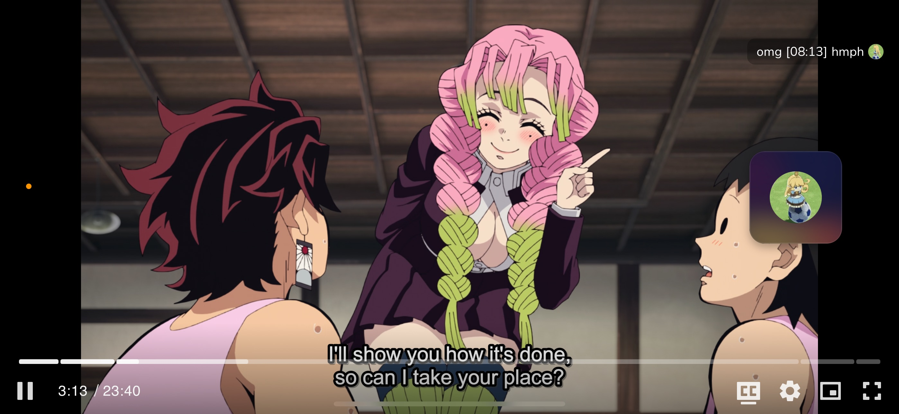
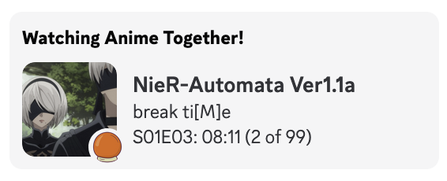
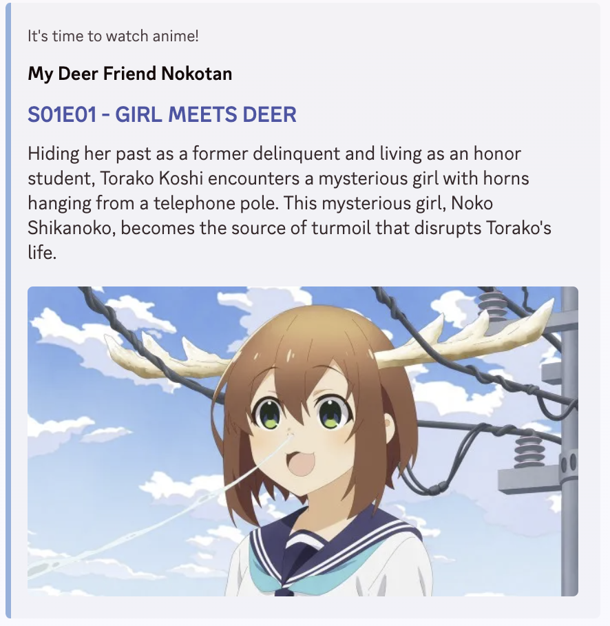

# Sparkle

Sparkle is a self-hosted watch-party app for the browser and Discord Activities.
A Next.js/React frontend and Go backend keep room playback, chat, and shared
activities synchronized. Browse existing processed media and a read-only Plex
library from the same Library view.



## Features

- Shared play/pause, seeking, media changes, reconnects, profiles, chat, and notifications.
- A paged, searchable poster Library with source filters, seasons, episodes, and **Raw**
  and **Processed** badges. Back/Forward preserves the room, hierarchy, and filters.
  Large Plex libraries load on demand; confidently matched processed titles reuse Plex
  covers and descriptions.
- Vidstack controls for playback, audio selection, subtitles, HDR options, and media versions.
- Embedded ASS/SSA with fonts, text subtitles, and PGS/SUP bitmap subtitles; local subtitle
  layers and audio preferences stay independent for each participant.
- Raw caption toggle and supported-browser picture-in-picture. Chrome Document PiP keeps
  subtitle layers; raw Google Cast options explain tab casting and direct-cast limitations.
- Shared YouTube, Chess, and Wordle tabs, plus browser voice chat outside Discord Activities.
- Discord identity, avatars, Rich Presence, and share previews with media artwork.

[Demo](https://sparkle.muddy.ca) · [Plex setup and playback limits](docs/plex-raw-media.md) ·
[Validation and browser coverage](docs/raw-media-validation.md)

## Media sources and playback

| Source    | What Sparkle reads                                                    | Playback                                                                                               |
| --------- | --------------------------------------------------------------------- | ------------------------------------------------------------------------------------------------------ |
| Processed | Existing `OUTPUT/<id>/job.json` directories and their prepared assets | Existing encoded video/audio, extracted subtitles, posters, chapters, and storyboards                  |
| Plex raw  | Plex metadata plus the original files through local folder mappings   | Original-file range requests; client-side demuxing and decoding through pinned libmedia AVPlayer 1.3.1 |

The backend serves prepared media; it does **not** create encodes, extract tracks,
or generate derivatives. For raw playback, it only reads Plex metadata/artwork
and mapped files. It never starts a Plex transcoding session or updates Plex
watched state. No complete raw file is cached. Requested metadata and artwork
use bounded caches, with a 512 MiB disk artwork budget.

Raw playback supports client WASM fallbacks, including TrueHD audio and embedded
subtitles. TrueHD output is decoded PCM, not Atmos bitstream passthrough. Raw
storyboards are currently omitted; processed storyboards remain available.

HDR prefers native video/MSE with exact codec/profile checks. Automatic mode tries
native Dolby Vision or HDR10+ and then a labeled compatible HDR10/HLG representation.
Vidstack → Video Settings also offers client-side SDR tone mapping for PQ/HLG and
Dolby Vision Profile 5 (including RPU reshaping). Source format, renderer and output
are reported separately. **Full dynamic-HDR display output is not yet qualified**;
native runtime admission is labeled unverified. Profile 7 enhancement layers are
not decoded; its compatible base layer remains playable. Unsupported playback does not prevent participation in
the room. See the [qualification record](docs/raw-media-validation.md) for tested
Windows Chrome/Edge combinations and pending Safari, mobile, Firefox, and Activity checks.

## Local development

Prerequisites: Node.js LTS with npm, Go 1.25 or newer, and either existing
processed output or a reachable Plex server with readable local media mappings.
Plex is optional. Normal builds do not require a server FFmpeg installation.

1. Install dependencies from the repository root:

   ```sh
   npm ci
   ```

2. For a fresh checkout, copy `.env.example` to `.env` and edit it. Preserve an
   existing `.env`. The example's Plex address, section IDs, and Windows paths
   must match your installation. For processed-only operation, remove all
   `PLEX_*` entries. Keep the four `SERVER_*` bases configured.

3. Start the backend in one terminal, from the root:

   ```powershell
   # Windows PowerShell
   .\start-backend.ps1
   ```

   ```sh
   # Linux/macOS or Bash
   bash ./start-backend.sh
   ```

4. Start the frontend in another terminal:

   ```sh
   npm run dev
   ```

Open <http://localhost:3001>. The backend defaults to port `1323`. The startup
scripts load the root `.env` and resolve relative output, profile, and cache
paths from the repository root. Set `ENV_FILE` to use another backend environment
file; the Bash script sources that file as shell code. Direct `go run ./cmd/api`
from `backend/` requires exporting configuration yourself.

`predev` and `prebuild` prepare the player assets automatically. The first run
may download pinned decoder files with SHA-256 verification. They are served
locally during playback. Use `npm run prepare:player` to prepare them separately;
the [player build guide](scripts/libmedia/README.md) covers changing the pinned integration.

## Configuration

Use [.env.example](.env.example) as the starting point. Frontend configuration
is read at runtime, including in Docker; changing these values does not require
rebuilding the image. Restart the relevant service after changing its environment.

### Frontend

| Variable                       | Purpose / example                                                        |
| ------------------------------ | ------------------------------------------------------------------------ |
| `SERVER_BE`                    | Browser API/WebSocket base; `/be`                                        |
| `SERVER_STATIC`                | Browser processed-asset base; `/static`                                  |
| `SERVER_INTERNAL_BE`           | Private API base for SSR and the frontend proxy; `http://localhost:1323` |
| `SERVER_INTERNAL_STATIC`       | Private static base; `http://localhost:1323/static`                      |
| `PUBLIC_DISCORD_CLIENT_ID`     | Optional Discord application/OAuth2 client ID                            |
| `SERVER_DISCORD_CLIENT_SECRET` | Optional server-only Discord OAuth2 secret                               |

Public bases beginning with `http://` or `https://` remain absolute; other values
are normalized to relative paths. Relative `/be` and `/static` requests are
forwarded to their corresponding internal bases. Keep private addresses and
credentials out of browser configuration.

### Backend

| Variable             | Purpose / example                                                         |
| -------------------- | ------------------------------------------------------------------------- |
| `ADDR`               | Listening address; `:1323`                                                |
| `OUTPUT`             | Existing processed-media root; `./output` in `.env.example`               |
| `JOBS_CACHE_TTL`     | Processed catalog refresh interval; `15m` in the example/startup scripts  |
| `PFP_DIR`            | Writable directory for new avatars; `./data/pfp`                          |
| `MAX_PFP_BYTES`      | Avatar upload limit; `12000000` bytes                                     |
| `MEDIA_CACHE_DIR`    | Writable artwork cache; `./cache/media`                                   |
| `PLEX_URL`           | Plex server base URL, without a token or credentials in the URL           |
| `PLEX_TOKEN`         | Server-only Plex token                                                    |
| `PLEX_LIBRARY_IDS`   | Comma-separated allowed section IDs; empty allows all movie/show sections |
| `PLEX_PATH_MAPPINGS` | JSON array mapping absolute Plex roots to absolute backend-visible roots  |

Windows mapping example:

```dotenv
PLEX_PATH_MAPPINGS='[{"plex":"/data/Managed-Videos","local":"O:/Managed-Videos"}]'
```

The local directory must already exist and be readable by the backend account.
Use forward slashes in Windows JSON; services may need an accessible UNC path
instead of an interactive mapped drive. Both writable directories must be
outside mapped media roots. Existing `OUTPUT/pfp` avatars remain readable;
new uploads go to `PFP_DIR`.

The API's direct configuration defaults and optional HTTP timeout settings are
defined in [config.go](backend/internal/config/config.go). Without the startup
scripts, its processed-cache default is `30m` and relative paths use the process
working directory. Rooms and their live state are held in backend memory and
are not persisted across a backend restart.

See [Plex configuration](docs/plex-raw-media.md#configuration) for library IDs,
mapping confinement, cache limits, and the catalog/streaming API.

## Docker

[compose.example.yml](compose.example.yml) defines the frontend and backend,
with processed output and original media mounted read-only. Avatars and artwork
cache have separate writable mounts.

Configure `.env`, set `PLEX_MEDIA_HOST_ROOT` to the host's media directory, and
adjust the Compose mapping's `plex` root to match Plex. Its `local` root must
match the **container** mount path, such as `/media/Managed-Videos`, even when
the host uses a Windows drive. For processed-only deployment, remove the Plex
environment entries and raw-media mount from your copy of the Compose file.

To build the current checkout locally with the image names used by that example:

```sh
docker build -t meinya/sparkle-api:latest -f backend/Dockerfile backend
docker build -t meinya/sparkle-next:latest .
docker compose -f compose.example.yml up -d
```

The frontend listens on port `3000`; internal requests use `sparkle-api:1323`.
Plex credentials are passed only to the backend. The API needs network access
to Plex and read access to the mounted media. Docker runtime validation is
still pending; the Linux backend cross-build is recorded in the validation guide.

For publishing images, `bash ./scripts/docker-build-all.sh` builds **and pushes**
both images; `build.sh` delegates to it. The scripts accept `SPARKLE_API_IMAGE`,
`SPARKLE_NEXT_IMAGE`, and `PLATFORM` (default `linux/amd64`).

## Discord Activities

The same frontend serves standalone browsers and Discord Activity frames. In an
Activity, the Embedded App SDK authorizes `identify` and `rpc.activities.write`,
exchanges the authorization code through `/api/token`, and uses the authenticated
Discord user for the Sparkle profile. Discord names and avatars replace local
profile editing; Rich Presence updates while watching.

To configure an Activity:

1. Create an application in the [Discord Developer Portal](https://discord.com/developers/applications),
   enable Activities, and add `https://127.0.0.1` as the OAuth2 redirect URI.
2. Add your Discord users as Application Testers.
3. Configure URL mappings for the frontend, API, and static assets. Their prefixes
   must match the pathnames in `SERVER_BE` and `SERVER_STATIC`.
4. Set `PUBLIC_DISCORD_CLIENT_ID` and `SERVER_DISCORD_CLIENT_SECRET` on the frontend server.

Example portal targets omit the protocol:

| Prefix    | Target                       |
| --------- | ---------------------------- |
| `/`       | `sparkle.example.com`        |
| `/be`     | `sparkle.example.com/be`     |
| `/static` | `sparkle.example.com/static` |

Use `SERVER_BE=/be` and `SERVER_STATIC=/static` with the private internal bases
from your deployment. Activity traffic uses Discord's proxy. Sparkle disables
its browser WebRTC voice chat in Activities and keeps decoding compatible with
non-isolated execution. Actual embedded raw-playback qualification remains
pending; ordinary non-isolated browser tests do not establish Activity support.

<details>
<summary>Discord screenshots</summary>






</details>

## Development checks

From the repository root:

```sh
npm run check
npm run test:player
npm run build
```

From `backend/`:

```sh
go test ./...
go vet ./...
go test -race ./...
```

Race checks require CGO and a supported C compiler. `npm run lint` runs Prettier
and ESLint across the repository; use scoped formatting for authored files rather
than rewriting generated or vendored assets.

Playwright requires a running app and installed Chrome by default. It uses port
`3002` unless overridden; for the local dev server, run:

```powershell
$env:SPARKLE_TEST_URL = 'http://127.0.0.1:3001'
npm run test:e2e
```

```sh
SPARKLE_TEST_URL=http://127.0.0.1:3001 npm run test:e2e
```

The synthetic Library test runs without media fixtures. Two-client playback and
multipart tests require mapped fixture IDs and otherwise skip. See
[reproduction settings](docs/raw-media-validation.md#reproduce) for browser
channels, fixtures, codec/HDR scripts, and remaining hardware checks. Test
artifacts go under ignored `cache/`.

## Repository guide

| Path                                           | Contents                                                              |
| ---------------------------------------------- | --------------------------------------------------------------------- |
| `app/`, `lib/server/`, `proxy.ts`              | Next.js App Router, SSR/share metadata, runtime API/static proxy      |
| `components/`, `lib/player/`, `lib/suptitles/` | Library, Vidstack playback, room UI, subtitles and synchronization    |
| `backend/cmd/api/`, `backend/internal/`        | Go API, Plex/catalog, processed-job reader and realtime room service  |
| `scripts/`, `vendor/libmedia/`                 | Build/validation scripts, pinned patched player and decoder artifacts |
| `tests/e2e/`, `docs/`                          | Browser tests, Plex setup and playback qualification records          |
| `public/media/`                                | Bundled emotes, sound effects and other room assets                   |

Contributor and coding-agent instructions live in [AGENTS.md](AGENTS.md).
Keep setup and behavior documentation aligned with code; record codec/device
evidence in the qualification guide rather than claiming universal browser support.
